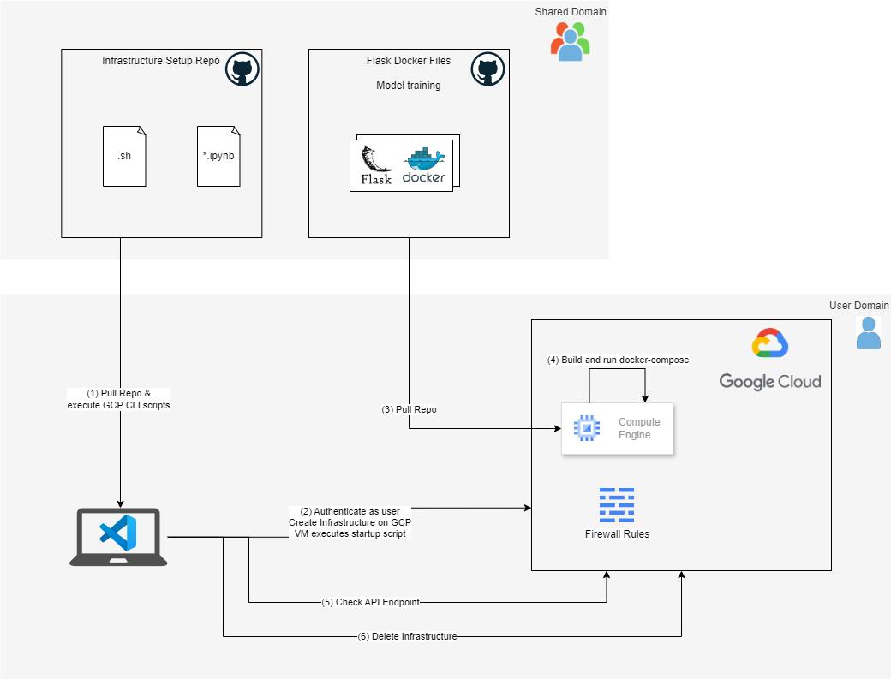

# waste-detection-aidl-gcp-infra

## Description

This repository automates the setup of the GCP infrastructure for deploying a dockerised Flask application used as part of the waste detection project in the AIDL postgraduate course at UPC.

It simplifies the process of setting up a VM, pulling the repository, and managing the environment with testing and debugging capabilities.

Authors: Martí Fabregat, Rafel Febrer, Ferran Miró-Gea and Miguel Ortiz. Supervised by Amanda Duarte.

## Setup
Start by creating a copy of the config file and rename it to config.env:
`cp config/config.example.env config/config.env`

Set parameters in `config.env` and the GIT_REPO_URL in the `startup-script.sh` which will be passed to the created VM.

Authenticate:
`gcloud auth login`

- if this crashes with MissingCodeError try this:
`gcloud auth login --no-launch-browser`

## Setup GCP Infrastructure

Run `./setup_gcp_infrastructure.sh ` for setting up the infrastructure.

This will create a VM in your GCP project, pull a repository (by default with a Flask Docker container) and start the container.

This process can take a few minutes (~7-8 minutes).

You can test the API by opening the `PUBLIC_IP:5000` in a browser or using the `test_api.ipynb` notebook.

### Debugging

To check the logs at the VM, ssh into the VM using either the GCP Console (browser) or running in the terminal the following command:
`gcloud compute ssh <VM_NAME> --zone <ZONE>`

Note that `<ZONE>` is a sub-zone inside of a location. Typically the zone will be equal to `<LOCATION>`+`-a`

In the VM check the logs with `nano /tmp/startup-script.log`

## Deleting the GCP Infrastructure

To delete the VM and the firewall rule run the following command:
` ./delete_gcp_infrastructure.sh `